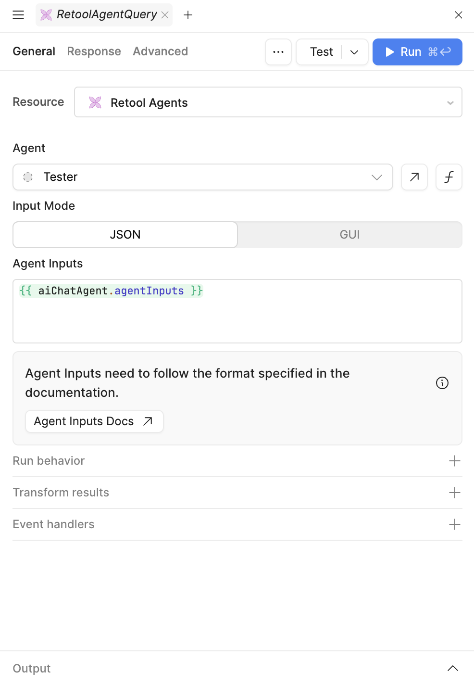

# AI Chat Plus - Retool Custom Component

A powerful custom Chat component for Retool that provides enhanced AI chat functionality with support for rendering interactive widgets in the chat flow, rich content, and seamless integration with **both Retool AI Query and Retool Agent Query**.

## Features

- **Interactive Chat Interface**: Modern chat UI (welcome step, chips) with mentionable interactive custom widgets
- **Widget System**: Extensible widget framework for rich content display
- **Advanced flow controls:** reset, restore, inject, auto submit
- **Dual Query Support**: Compatible with both **Retool AI Query** (simple LLM calls) and **Retool Agent Query** (full agent workflows with polling, tool approvals, and status management)
- **Error Handling (beta)**: error handling with retry capabilities
- **Tool call permission (beta)** when used with **Retool Agent Query**

## Getting started

### Bring the custom component library to your Retool instance

Clone this repository  `git clone https://github.com/EloquentOps/retool-ai-chat-plus` and follow [this guide from Retool](https://docs.retool.com/apps/guides/custom/custom-component-libraries) documentation to install the library properly.

Here a quick step by step:

- Clone the repository
- Enter in the folder and run `npm install` (Node >= 20.x required)
- Now run `npm run login` select your option and provide your API key
- Run `npm run init` and give the library name and description `Chat Plus`
- Finally, run `npm run deploy`
- Now you can go to your Retool instance, that is ready to include the component

### Add the Chat component into your Retool app

Find the Chat Plus component in component list and drag it into your Retool app:

### Configure the query and wire it with the component

There are 2 way to use the component, depending of your preference and requirements.

 #### AI Query

Use an AI Query when you don't need complex agentic flow. Setup is easier and latency is better too.

Check this screenshot for proper configuration given the Chat component name is `aiChatPlus1`.

System prompt can be personalized as your wish.

#### Agent Query

Use an Agent Query when you need complex agentic flow, to call tools, and let the agent solving more independetly the user request.

Check this screenshot for proper configuration given the Chat component name is `aiChatAgent` and you have an Agent ready to be used (i.e. Tester).

### Component Properties

Here the minimal configuration for make the Chat Plus component works with a Retool AI Query. You need to wire the Query in queryResponse and set the submit event to the query trigger:

#### Input Properties

| Property            | Type   | Default | Description                                                  |
| ------------------- | ------ | ------- | ------------------------------------------------------------ |
| `welcomeMessage`    | string | ""      | Welcome message displayed when chat is empty. If you leave this empty and you don't set the promptChips, the welcome screen won't be shown. |
| `widgetsOptions`    | object | {}      | Widget configuration options (keys determine enabled widgets, empty = only text widget) |
| `promptChips`       | array  | []      | Suggested action chips for quick interactions, object schema: {label:'', icon:'', question:''} |
| `history`           | array  | []      | Chat message history                                         |
| `queryResponse`     | object | {}      | AI agent response data                                       |
| `agentInputs`       | object | {}      | Read only, required to wire the component with the query     |
| `widgetPayload`     | object | {}      | Widget interaction payload                                   |
| `submitWithPayload` | object | {}      | Programmatic submit with payload                             |

#### Events

| Event            | Description                                         |
| ---------------- | --------------------------------------------------- |
| `submitQuery`    | Triggered when a query is submitted to the AI agent |
| `widgetCallback` | Triggered when a widget interaction occurs          |

### How It Works

1. **Prompt Injection**: The component automatically injects widget-specific instructions into your AI query's prompt when mentioned by the user.
2. **Response Detection**: The component automatically detects whether you're using AI Query (simple) or Agent Query (complex) format
3. **JSON Response**: The LLM is guided to respond with structured JSON containing widget type and data
4. **Widget Rendering**: The component parses the JSON response and renders the appropriate widget
5. **Status Management**: For Agent Query, the component handles polling, status updates, and tool approvals automatically
6. **User Interaction**: Widget interactions are captured and can trigger additional AI queries

### LLM Model Compatibility

**Recommended**: This component has been extensively tested with **OpenAI GPT-4.1** and shows the highest reliability and consistency in following widget instructions.

**Alternative Models**: While the component can work with other LLM models, our testing shows reduced reliability in:
- Following widget-specific instructions
- Generating consistent JSON responses
- Maintaining widget data structure integrity

**Best Practice**: Use OpenAI GPT-4.1 for optimal results, especially in production environments.

We've experienced a good compromise of reliability and cost with OpenAI o3-mini

## License

This project is licensed under the MIT License - see the LICENSE file for details.

