# AI Chat Plus - Retool Custom Component

A powerful custom chat component for Retool that provides enhanced AI chat functionality with support for rendering interactive widgets in the chat flow, rich content, and seamless integration with **both Retool AI Query and Retool Agent Query**.


# Table of content

- [Features](#features)
- [Getting started](#getting-started)
- [Built-in Widgets](WIDGETS.md)
- [How It Works](#how-it-works)
- [LLM Model Compatibility](#llm-model-compatibility)
- [Custom widget list](#custom-widget-list)
- [License](#license)

## Features

- **Interactive Chat Interface**: Modern chat UI (welcome step, chips) with mentionable interactive custom widgets
- **Widget System**: Extensible widget framework for rich content display
- **Pinned Panel**: Pin widgets in the right panel (eject from the chat flow)
- **Advanced flow controls:** reset, restore, inject, auto submit
- **Dual Query Support**: Compatible with both **Retool AI Query** (simple LLM calls) and **Retool Agent Query** (full agent workflows with polling, tool approvals, and status management)
- **Error Handling (Beta)**: error handling with retry capabilities
- **Tool call permission (Beta)** when used with **Retool Agent Query**


## Getting started

### Bring the custom component library to your Retool instance

Clone this repository:

```shell
git clone https://github.com/EloquentOps/retool-ai-chat-plus
```

and follow [this guide from Retool](https://docs.retool.com/apps/guides/custom/custom-component-libraries) documentation to install the library properly.

Or here's a quick step-by-step:

- Clone the repository
- Enter in the folder and run `npm install` (Node >= 20.x required)
- Now run `npm run login` select your option (cloud, on-prem, local) and provide your API key
- Run `npm run init` and give the library name and description `Chat Plus` or what you prefer
- Finally, run `npm run deploy`
- Now you can go to your Retool instance, that is ready to include the component

> **⚠️ Important**: If you want to continue to get updates from the main repository into your checkout without breaking links with your used components in apps, you MUST use as library name **Ai Chat Plus** when the CLI asks for library name during the `init` phase.


### Add the Chat component into your Retool app

Find the Chat Plus component in component list and drag it into your Retool app:

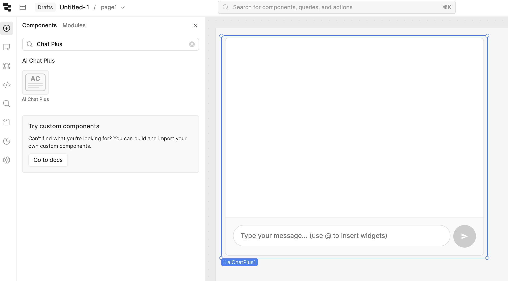


### Configure the query and wire it with the component

There are 3 ways to use the component, depending on your preference and requirements.

 #### AI Query

Use an AI Query when you don't need complex agentic flow. Setup is easier and latency is better too.

Check this screenshot for proper configuration given the Chat component name is `aiChatPlus1`.

The system prompt can be personalized as you wish.

Pay attention to the **transform results** panel.

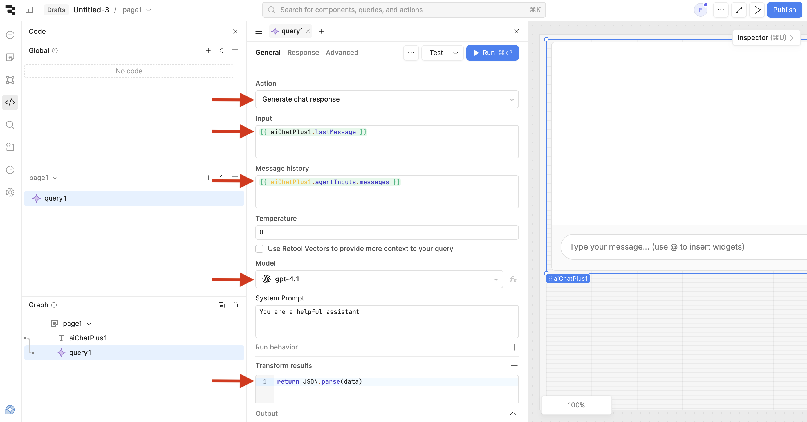

---

#### Agent Query

Use an Agent Query when you need complex agentic flow, to call tools, and let the agent solve user requests more independently.

Check this screenshot for proper configuration given the Chat component name is `aiChatPlus1` and you have an Agent ready to be used (i.e. Tester).

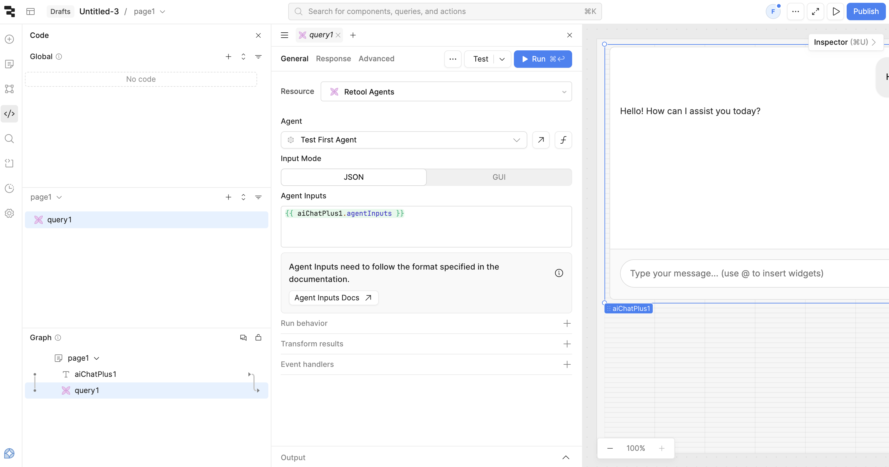

---

#### Async Mode

Use Async Mode when you want to run a Retool Workflow asynchronously instead of an AI or Agent Query. Set `queryResponse` to `{ asyncMode: true, loadingInProgress: true }` to enable async mode. In this mode:

- When `queryResponse.asyncMode === true`, the component treats it as async mode and ignores `queryResponse.widgets` (no automatic message processing)
- Use `queryResponse.loadingInProgress` to control the loading state — set it to `true` when the workflow is running, `false` when complete
- Sessions are loaded via `submitWithPayload` with `action: 'restore'`
- Wire `firstSubmit` to create a session and trigger your Workflow; wire `submitQuery` to trigger the Workflow for subsequent messages
- When the workflow completes, update `queryResponse.loadingInProgress` to `false` and restore the session with `submitWithPayload` containing the final messages
- Trace steps are not supported in async mode

### Component Properties

Here's the minimal configuration to make the Chat Plus component work with a Retool AI Query or Retool Agent Query. You need to wire the Query in queryResponse and set the submit event to the query trigger:

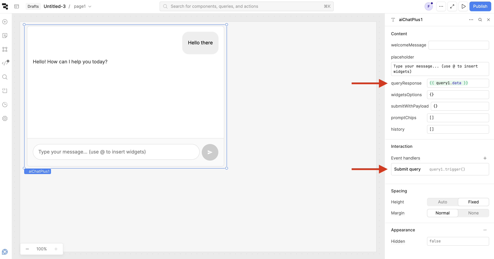


### Welcome view

By setting one or both of the following properties:

- welcomeMessage
- promptChips

A welcome view will be rendered before the chat flow.

The `welcomeMessage` allow to configure the top message:

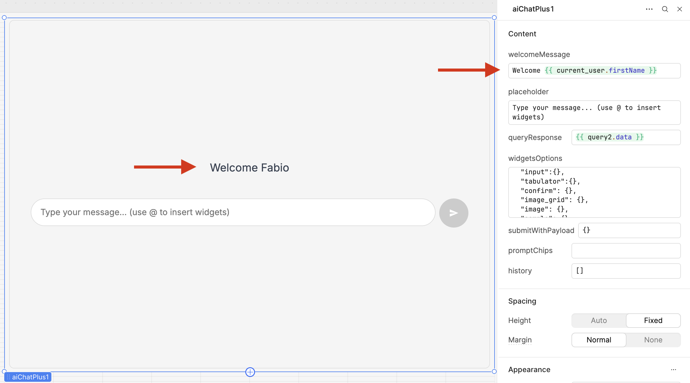

The `promptChips` array allows to add one or more interactive buttons at the bottom. Each chip can be one of two types:

**Type 1: Question Chip** - Submits a pre-configured user question to the chat
- Schema: `{label: '', icon: '', question: ''}`
- When clicked, submit the question text

**Type 2: Payload Chip** - Triggers a custom callback with a payload
- Schema: `{label: '', icon: '', payload: {a:1, b:2}}`
- When clicked, sets the `chipPayload` property and triggers the `chipCallback` query trigger
- Access the payload in your Retool query via `aiChatPlus1.chipPayload`

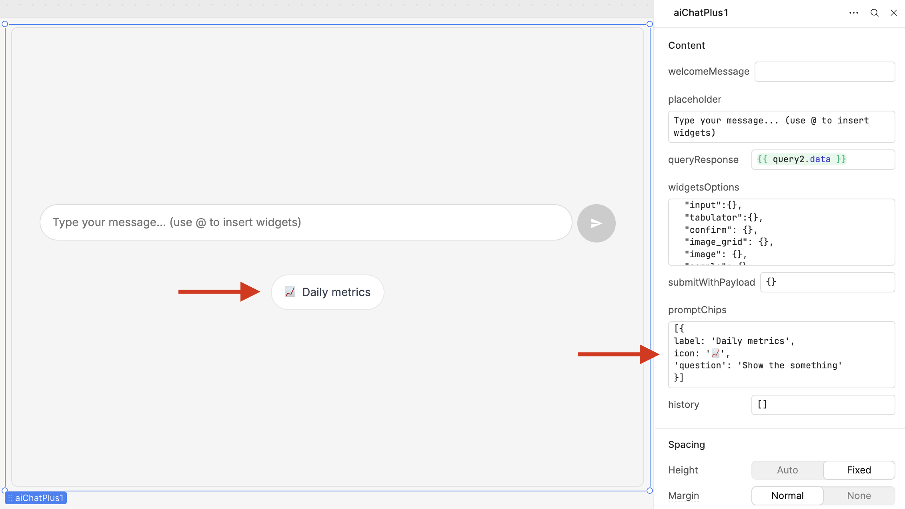


### Pinned Panel

Every rendered widget can be pinned on a side panel. It's a way to detach it them from the chat flow for comparison purposes.

There's a plan to allow the chat submit to interact with the visible pinned widget.


### Component Preferences

The `componentPreferences` object allows you to customize both stylistic and behavioral aspects of the component.

#### Available Properties

| Property | Type | Default | Description |
|----------|------|---------|-------------|
| `wrapperBorder` | string | `"visible"` | Controls the visibility of the component's wrapper border. Set to `"hidden"` to hide the border completely. |
| `lockUI` | boolean | `false` | When set to `true`, disables all user interaction controls in the component. This includes: the submit bar (input field and send button), widget footer buttons (remove, pin, try again), pinned widget close buttons, and prompt chips. Useful for read-only modes or when you want to prevent user interactions programmatically. |
| `hideWidgetFooter` | boolean | `false` | When set to `true`, hides the widget footer (containing pin, try again, and delete buttons) for all widgets. This option works independently of `lockUI` - you can hide the footer even when the UI is not locked. |
| `showTraceSteps` | boolean | `false` | When set to `true`, shows the **Steps & reasoning** inspector below assistant responses that have agent trace data. Users can expand steps to inspect the model's thinking/reasoning, tool parameters, and results. Useful for debugging or transparency when using Retool Agent. |
| `welcomeViewHideSubmitBar` | boolean | `false` | When set to `true`, hides the entire submit bar (input field and send button) in the welcome view only. Use this when you want prompt chips as the only starting point—users must click a chip to begin. Does not affect the submit bar once the chat has messages. |

#### Example Usage

```javascript
// Hide the border
{
  "wrapperBorder": "hidden"
}

// Lock the UI to prevent all interactions
{
  "lockUI": true
}

// Hide widget footer
{
  "hideWidgetFooter": true
}

// Enable Steps & reasoning inspector (agent trace)
{
  "showTraceSteps": true
}

// Hide submit bar in welcome view (chips only as starting point)
{
  "welcomeViewHideSubmitBar": true
}

```


### Options, properties, events

#### Configurable options

| Property            | Type   | Description                                                  |
| ------------------- | ------ | ------------------------------------------------------------ |
| `welcomeMessage`    | string | Welcome message displayed when chat is empty. If you leave this empty and you don't set the promptChips, the Welcome view won't be shown. |
| `widgetsOptions`    | object | Widget configuration options (keys determine enabled widgets, empty = only text widget) to enable the widgets and providing additional configuration per-widget. |
| `promptChips`       | array  | Suggested action chips in Welcome view. Each chip object can be either: `{label:'', icon:'', question:''}` to submit a pre-configured question, or `{label:'', icon:'', payload:{}}` to trigger `chipCallback` query and access payload via `chipPayload` property |
| `queryResponse`     | object | AI agent response data, **required**. For async mode, set to `{ asyncMode: true, loadingInProgress: boolean }` to control async behavior. |
| `componentPreferences`  | object | Options for component preferences (stylistic and behavioral). See Component Preferences section for details. |
| `submitWithPayload` | object | Programmatic control: `restore` \| `inject` \| `submit` \| `stop` \| `fill` (see Submit With Payload). |


#### Readable properties

| Property            | Type   | Description                                                  |
| ------------------- | ------ | ------------------------------------------------------------ |
| `widgetPayload`     | object | Widget payload you can read after `widgetCallback` event     |
| `chipPayload`       | object | Chip payload you can read after `chipCallback` event         |
| `history`           | array  | Chat message history                                         |
| `lastMessage`       | string | Last user message submitted                                  |
| `lastResponse`      | object | Last chat response received                                  |
| `agentInputs`       | object | Required to wire the component with the query                |

#### Events

| Event            | Description                                         |
| ---------------- | --------------------------------------------------- |
| `submitQuery`    | It triggers the LLM query to get the response for the chat |
| `firstSubmit`    | Triggered when the first message is submitted       |
| `lastResponse`   | Triggered when the last response is done            |
| `widgetCallback` | Triggered when a widget interaction occurs          |
| `chipCallback`   | Triggered when a chip (with payload) interaction occurs          |


## Widgets

Here the `widgetsOptions` object to enable all the present widgets in the component:

```
{
  "google_map": {
    "apiKey": "....required...."
  },
  "chart":{},
  "image":{},
  "select":{},
  "tabulator":{},
  "image_grid":{},
  "input":{},
  "checklist":{},
  "fullcalendar":{} 

}
```
Widgets need to be enabled in order to be listed in the mention list (just the key present with an empty object is enough). 

Shared properties per widget:

```shell
chart:{
  injectAlways: Boolean // default false, if true always inject the widget instruction, so explicit user mention is not necessary.
}
```

You can mention one or more widgets in the question. A list of widgets will then be rendered. This is an explicit mechanism to avoid polluting the context, making it very difficult for the model to pick up the right widget. 

You can always inject per-widget instructions, but take into account that the more instructions present, the less reliable the LLM is at choosing the right one.

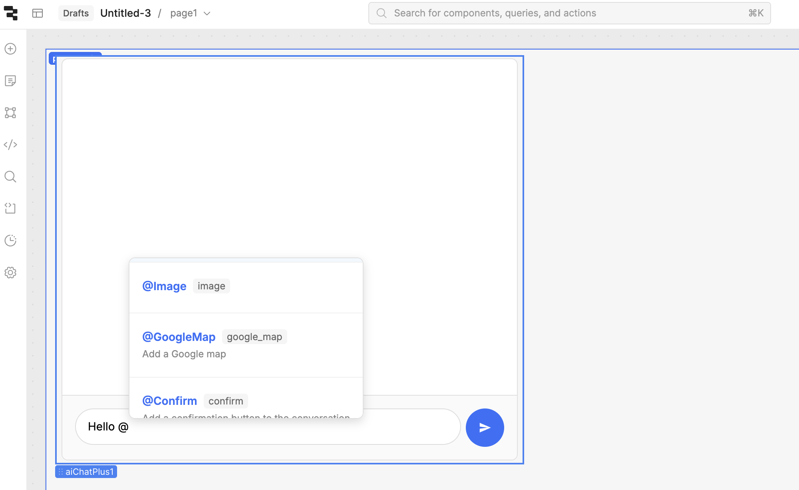

Here an example of a question that returns a list of 4 widgets in one shot, in this order: chart, text, chart, text.

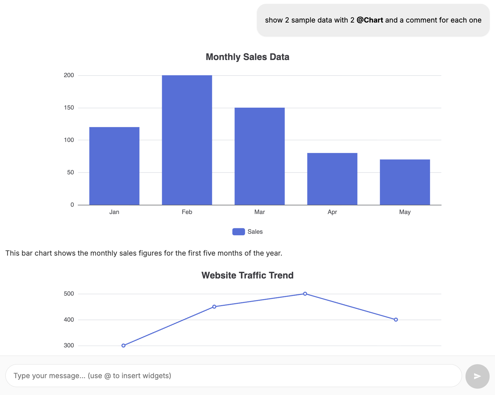

## Custom widget list

### Plugin Configuration

Widgets are managed via `retool-widget-plugins.json`:

- **`external`**: Widgets in development (from `src/components/widgets/external/`)
- **`plugins`**: Published npm widget packages
- **`globalAssets`**: CSS and font URLs loaded globally

Edit the config file and run `npm run build:plugins` to regenerate the widget registry.


See [WIDGETS.md](WIDGETS.md) for detailed documentation on all available widgets.

---

### Submit With Payload

This is a powerful way to imperatively control the chat flow of the component at run-time.


Just use a Retool variable as a bridge and set it as the `submitWithPayload` parameter in the component. Then, set that variable with a payload to feed the component at run-time.

The variable must follow this schema:

```js
{
  action: 'restore|inject|submit|stop|fill',
  messages: [ /* required for restore, inject, submit */
    {role: 'user|assistant', content: 'your content 1', hidden: true},
    {role: 'user|assistant', content: 'your content 2', autoSubmit:true}
  ],
  text: '...'  /* required for fill: pre-fill the input bar without submitting */
}
```

**Note for Async Mode**: When using async mode (`queryResponse.asyncMode === true`), control the loading state via `queryResponse.loadingInProgress` instead of using `asyncLoading` in the restore payload.

**Important Note on Payload Reactivity**: The component only reacts when the `submitWithPayload` object changes. If you need to trigger a reaction with the same payload (e.g., to reset the chat with an empty array), you can add a `timestamp` property to make the payload different:

```js
{
  action: 'restore',
  messages: [],
  timestamp: Date.now() // Add this to force component reaction with same payload
}
```

Here are the meanings of the `action` values:

- **restore**: replace the whole chat feed and history with a custom payload
- **inject**: add a payload to the current chat feed and history
- **submit**: append messages to history and immediately submit the last user message
- **stop**: stop the current submit/polling
- **fill**: pre-fill the input bar with the value of `text` **without submitting**. The user can review and edit the text before sending.

Example — pre-fill the input bar without submitting (user can edit and submit manually):

```js
{
  action: 'fill',
  text: 'Summarize the last 5 emails'
}
```

The message object can contain the optional `autoSubmit` property to trigger an internal submit of the chat component (for **restore**).

It can also have the optional `hidden` property to hide that content from the chat interface, while still keeping it present in the history and context.

Wire the variable with the component:

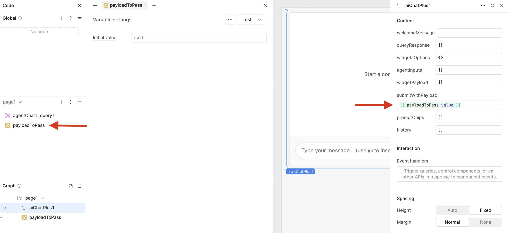

Set the variable at run-time:

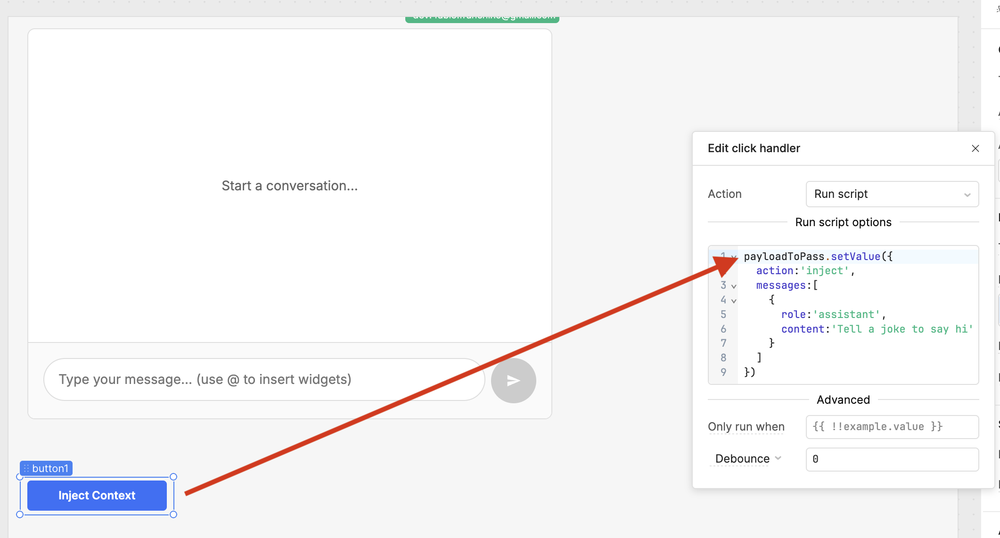

After clicking the button, the chat component will contain that context, and the LLM will be affected by it:

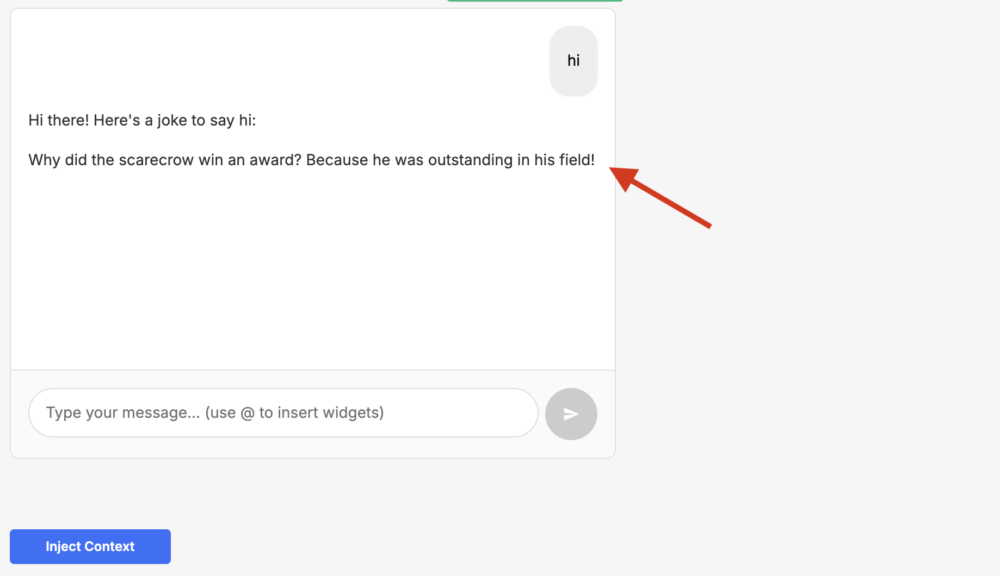


## Widget Callback

A widget can implement a callback call with payload.
When implemented, the component user can exploit the `widgetCallback` event wired with a JS Query such as:

```js
const payload = aiChatPlus1.widgetPayload

if(payload.type === 'google_map'){
  utils.confetti()
}
```

You can use both the event trigger and the payload from `widgetPayload` property.
You can then inspect the object and decide what to do with it.


---

## How It Works

1. **Prompt Injection**: The component automatically injects widget-specific instructions into your AI query's prompt when mentioned by the user.
2. **Response Detection**: The component automatically detects whether you're using AI Query (simple) or Agent Query (complex) format
3. **JSON Response**: The LLM is guided to respond with structured JSON containing widget type and data
4. **Widget Rendering**: The component parses the JSON response and renders the appropriate widget
5. **Status Management**: For Agent Query, the component handles polling, status updates, and tool approvals automatically
6. **User Interaction**: Widget interactions are captured and can trigger additional AI queries


## LLM Model Compatibility

**Recommended**: This component has been extensively tested with **OpenAI GPT-4.1** and shows the highest reliability and consistency in following widget instructions.

**Alternative Models**: While the component can work with other LLM models, our testing shows reduced reliability in:
- Following widget-specific instructions
- Generating consistent JSON responses
- Maintaining widget data structure integrity

**Best Practice**: Use OpenAI GPT-4.1 for optimal results, especially in production environments.

We've found a good compromise between reliability and cost with OpenAI o3-mini


## License

This project is licensed under the MIT License - see the LICENSE file for details.

