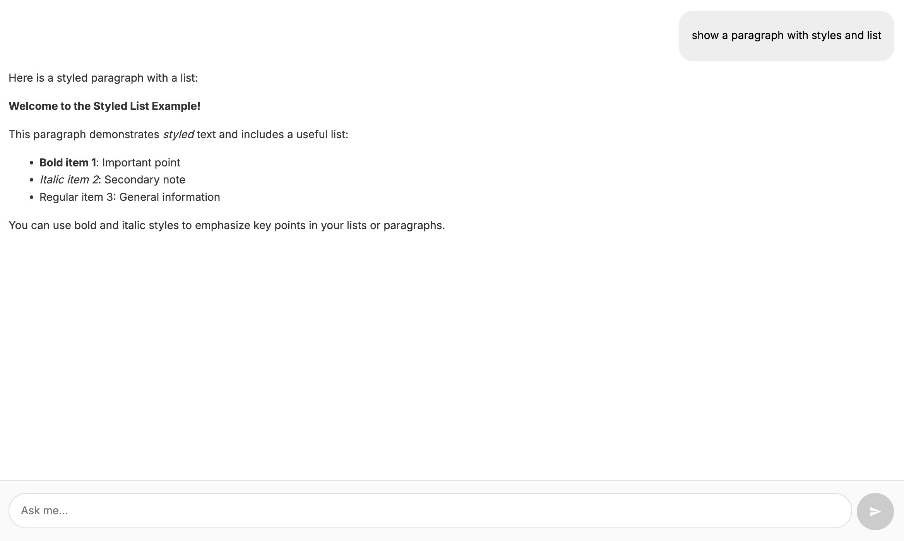
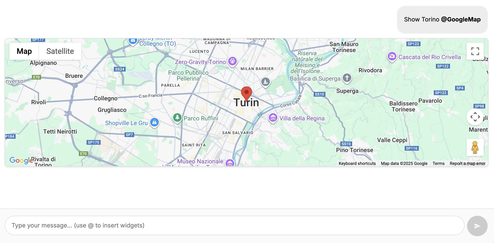
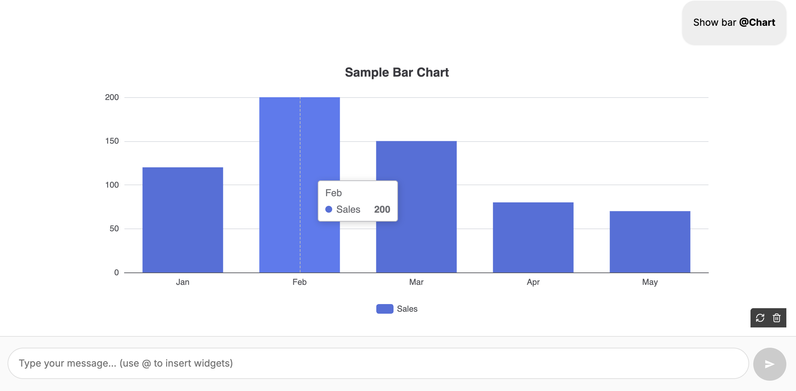
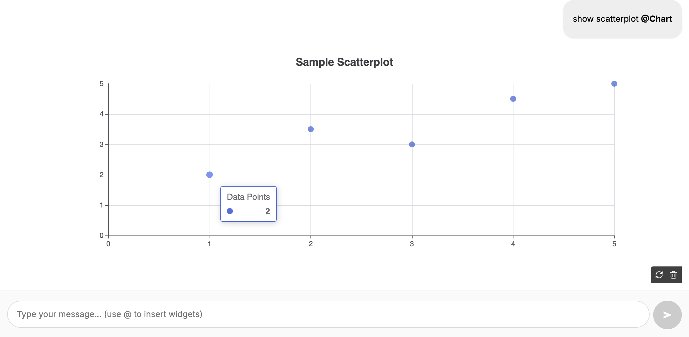
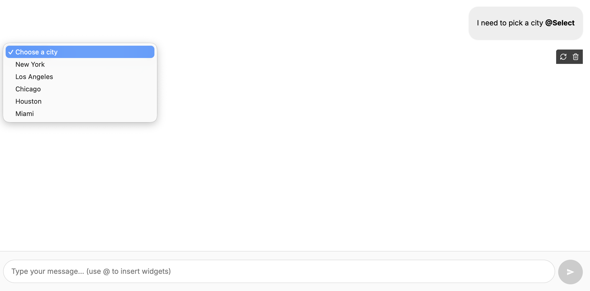
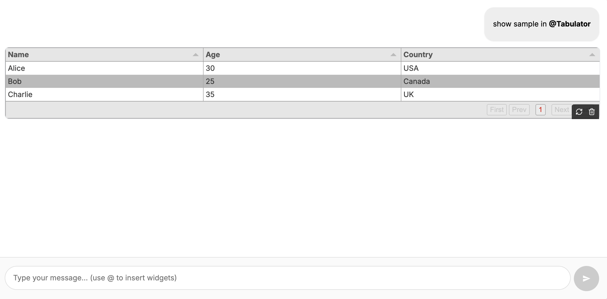
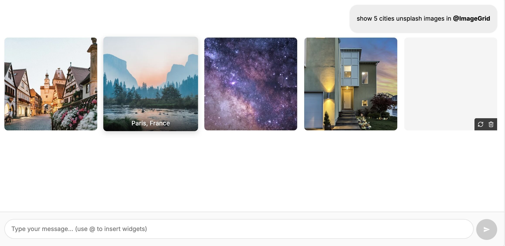
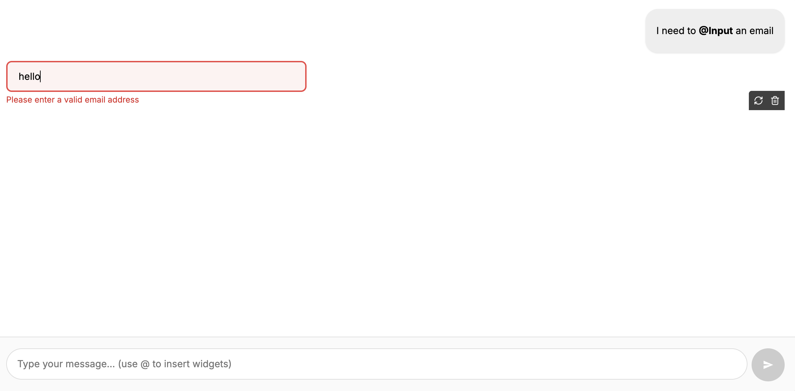
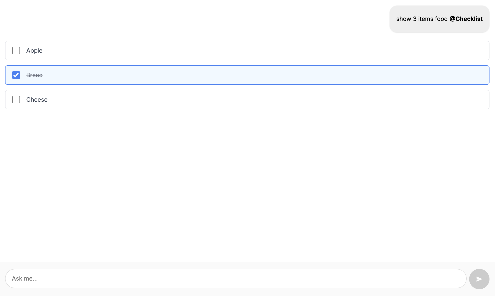
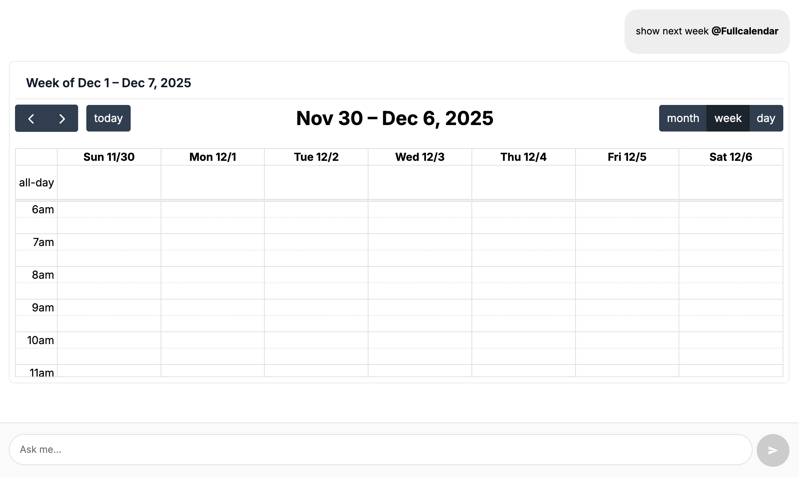

# AI Chat Plus - Retool Custom Component

A powerful custom chat component for Retool that provides enhanced AI chat functionality with support for rendering interactive widgets in the chat flow, rich content, and seamless integration with **both Retool AI Query and Retool Agent Query**.


## Features

- **Interactive Chat Interface**: Modern chat UI (welcome step, chips) with mentionable interactive custom widgets
- **Widget System**: Extensible widget framework for rich content display
- **Advanced flow controls:** reset, restore, inject, auto submit
- **Dual Query Support**: Compatible with both **Retool AI Query** (simple LLM calls) and **Retool Agent Query** (full agent workflows with polling, tool approvals, and status management)
- **Error Handling (Beta)**: error handling with retry capabilities
- **Tool call permission (Beta)** when used with **Retool Agent Query**


## Getting started


### Bring the custom component library to your Retool instance

Clone this repository:

```shell
git clone https://github.com/EloquentOps/retool-ai-chat-plus
```

and follow [this guide from Retool](https://docs.retool.com/apps/guides/custom/custom-component-libraries) documentation to install the library properly.

Or here's a quick step-by-step:

- Clone the repository
- Enter in the folder and run `npm install` (Node >= 20.x required)
- Now run `npm run login` select your option (cloud, on-prem, local) and provide your API key
- Run `npm run init` and give the library name and description `Chat Plus` or what you prefer
- Finally, run `npm run deploy`
- Now you can go to your Retool instance, that is ready to include the component


### Add the Chat component into your Retool app

Find the Chat Plus component in component list and drag it into your Retool app:


### Configure the query and wire it with the component

There are 2 ways to use the component, depending on your preference and requirements.

 #### AI Query

Use an AI Query when you don't need complex agentic flow. Setup is easier and latency is better too.

Check this screenshot for proper configuration given the Chat component name is `aiChatPlus1`.

The system prompt can be personalized as you wish.

Pay attention to the **transform results** panel.


---

#### Agent Query

Use an Agent Query when you need complex agentic flow, to call tools, and let the agent solve user requests more independently.

Check this screenshot for proper configuration given the Chat component name is `aiChatPlus1` and you have an Agent ready to be used (i.e. Tester).


### Component Properties

Here's the minimal configuration to make the Chat Plus component work with a Retool AI Query or Retool Agent Query. You need to wire the Query in queryResponse and set the submit event to the query trigger:


### Welcome view

By setting one or both of the following properties:

- welcomeMessage
- promptChips

A welcome view will be rendered before the chat flow.

The `welcomeMessage` allow to configure the top message:


The `promptChips` array allows to add one or more interactive buttons at the bottom to let the user quickly launch pre-configured questions:


### Style Preferences

The `stylePreferences` object is to customize the style and look&feel of the component.
Available properties are:

```
{
  "wrapperBorder": "visible" // default, you can set "hidden" to hide the border
}
```


#### Options list

| Property            | Type   | Default | Description                                                  |
| ------------------- | ------ | ------- | ------------------------------------------------------------ |
| `welcomeMessage`    | string | ""      | Welcome message displayed when chat is empty. If you leave this empty and you don't set the promptChips, the Welcome view won't be shown. |
| `widgetsOptions`    | object | {}      | Widget configuration options (keys determine enabled widgets, empty = only text widget) to enable the widgets and providing additional configuration per-widget. |
| `promptChips`       | array  | []      | Suggested action in Welcome view chips for quick interactions, object schema: {label:'', icon:'', question:''} |
| `history`           | array  | []      | Chat message history                                         |
| `queryResponse`     | object | {}      | AI agent response data                                       |
| `stylePreferences`  | object | {}      | Options for style preferences                                |
| `agentInputs`       | object | {}      | Read only, required to wire the component with the query     |
| `widgetPayload`     | object | {}      | Widget payload you can read after `widgetCallback` event     |
| `submitWithPayload` | object | {}      | Programmatic submit with payload                             |

#### Events

| Event            | Description                                         |
| ---------------- | --------------------------------------------------- |
| `submitQuery`    | It triggers the LLM query to get the response for the chat |
| `widgetCallback` | Triggered when a widget interaction occurs          |


## List of built-in widgets (all in beta)

Here the `widgetsOptions` object to enable all the present widgets in the component:

```
{
  "google_map": {
    "apiKey": "....required...."
  },
  "chart":{},
  "image":{},
  "select":{},
  "tabulator":{},
  "image_grid":{},
  "input":{},
  "checklist":{},
  "fullcalendar":{} 

}
```
Widgets need to be enabled in order to be listed in the mention list (just the key present with an empty object is enough). 

Shared properties:
- injectAlways: boolean, default false // always inject the widget instruction, so explicit user mention is not necessary.

Only one widget can be mentioned in the question text at a time. That widget will then be rendered. This is an explicit mechanism to avoid polluting the context, making it very difficult for the model to pick up the right widget. 

You can always inject per-widget instructions, but take into account that the more instructions present, the less reliable the LLM is at choosing the right one.


---

#### Text

It's the default widget for the chat responses, always present, it cannot be disabled.

It renders text and markdown as well, according to your prompt instructions.
External URLs open always on new window.



---

#### GoogleMap

It renders a full Google Map positioned with a given location.

It requires a valid API Key from Google.



---

#### Chart

It renders an EChart component. The chart type is defined by the LLM, according to the user hints and the type of data is needs to show.





---

#### Image

It renders an image, that can be zoomed in and out.


---

#### Select

It renders a select component 



---

#### Tabulator

It renders a table using Tabulator library.



---

#### ImageGrid

It renders a list of images in a grid layout.



---

#### Input

It renders an input field with validation reg-ex and message



---

#### CheckList

It renders an interactive checklist with checkbox



---

#### Fullcalendar

It renders an interactive fullcalendar.js component



---


### Widget Callback

A widget can implement a callback call with payload.
When implemented, the component user can exploit the `widgetCallback` event wired with a JS Query such as:

```js
const payload = aiChatPlus1.widgetPayload

if(payload.type === 'google_map'){
  utils.confetti()
}
```

You can use both the event trigger and the payload from `widgetPayload` property.
You can then inspect the object and decide what to do with it.


---

### Submit With Payload

This is a powerful way to imperatively control the chat flow of the component at run-time.


Just use a Retool variable as a bridge and set it as the `submitWithPayload` parameter in the component. Then, set that variable with a payload to feed the component at run-time.

The variable must follow this schema:

```js
{
  action: 'restore|inject',
  messages: [
    {role: 'user|assistant', content: 'your content 1', hidden: true},
    {role: 'user|assistant', content: 'your content 2', autoSubmit:true}
  ]
}
```

Here are the meanings of the `action` values:

- restore: replace the whole chat feed and history with a custom payload
- inject: add a payload to the current chat feed and history

The message object can contain the optional `autoSubmit` property to trigger an internal submit of the chat component.

It can also have the optional `hidden` property to hide that content from the chat interface, while still keeping it present in the history and context.

Wire the variable with the component:


Set the variable at run-time:


After clicking the button, the chat component will contain that context, and the LLM will be affected by it:


---

## How It Works

1. **Prompt Injection**: The component automatically injects widget-specific instructions into your AI query's prompt when mentioned by the user.
2. **Response Detection**: The component automatically detects whether you're using AI Query (simple) or Agent Query (complex) format
3. **JSON Response**: The LLM is guided to respond with structured JSON containing widget type and data
4. **Widget Rendering**: The component parses the JSON response and renders the appropriate widget
5. **Status Management**: For Agent Query, the component handles polling, status updates, and tool approvals automatically
6. **User Interaction**: Widget interactions are captured and can trigger additional AI queries


## LLM Model Compatibility

**Recommended**: This component has been extensively tested with **OpenAI GPT-4.1** and shows the highest reliability and consistency in following widget instructions.

**Alternative Models**: While the component can work with other LLM models, our testing shows reduced reliability in:
- Following widget-specific instructions
- Generating consistent JSON responses
- Maintaining widget data structure integrity

**Best Practice**: Use OpenAI GPT-4.1 for optimal results, especially in production environments.

We've found a good compromise between reliability and cost with OpenAI o3-mini


## License

This project is licensed under the MIT License - see the LICENSE file for details.

